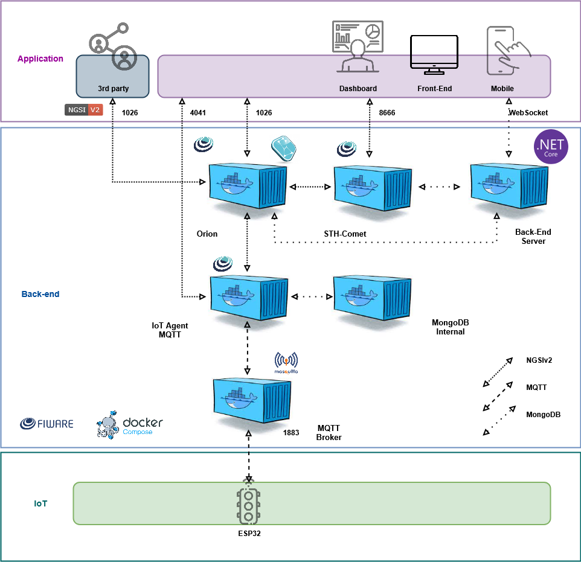

# ⚽ FutMap

Projeto de IoT desenvolvido para a Sprint do Passa Bola na disciplina de Edge Computing and Computer Systems da FIAP.

## 📝 Descrição do Projeto

Este projeto traz a experiência de um placar analogico para partidas amadoras de futebol de mesa, utilizando IoT e automação para detecção de gols em tempo real.

Utilizando o ESP32

A detecção ocorre quando a bola atravessa uma barreira infravermelha (IR), acionando a exibição do placar em um display LCD I2C, que mostra em tempo real o número de gols marcados. O evento também pode ser anulado com um botão de anular gol.

Cada gol detectado é enviado automaticamente para um servidor, que atualiza o placar em tempo real. Esse placar pode ser incorporado a transmissões ao vivo ou exibido no site do Passa Bola, proporcionando uma experiência semelhante à de jogos profissionais e aumentando o engajamento do público.

## 🎯 Escopo

- Protótipo com ESP32, LCD I2C e cinco Botões;
- Simulação fiel no Wokwi com possibilidade de migração para hardware real sem alterações significativas;
- Integração opcional com servidor (HTTP/MQTT) e dashboard em tempo real usando Node-Red.

## ✅ Objetivos Entregáveis

- Firmware funcional para ESP32 (código-fonte);
- Instruções para simulação no Wokwi e execução no hardware;
- Código do servidor simples e dashboard (opcional);
- Plano de testes e critérios de aceitação.

## 🏆 Critérios de Aceitação

## 🏗️ Arquitetura Proposta
A arquitetura do projeto foi desenhada para integrar sensores físicos, processamento em tempo real e visualização dos dados em um painel de controle.

- 🛰️ Sensores IoT (IR): detectam quando a bola cruza a linha do gol;
- 📡 MQTT Broker (Mosquitto): atua como intermediário para receber e distribuir as mensagens publicadas pelos sensores;
- 📊 Dashboard: fornece uma interface gráfica acessível via navegador, permitindo acompanhar os gols em tempo real;
- 🖥️ Display LCD I2C: funciona como atuador, exibindo o placar físico atualizado conforme os dados processados.

Toda essa infraestrutura roda em containers Docker, facilitando a instalação, configuração e portabilidade do sistema.

<div align="center">
  
  
  
</div>


## 🧰 Componentes Utilizados

- ESP32
- 5xBotão
- LCD I2C

## 🛠️ Recursos Necessários

### Software / Ferramentas

- Wokwi (simulação);
- Arduino IDE (ou PlatformIO) com suporte a ESP32;
- Node-Red (para servidor e dashboard, rodando em máquina virtual com FIWARE via Docker Compose);
- Navegador moderno para dashboard (opcional).

### Bibliotecas Recomendadas

- WiFi.h (ESP32);
- PubSubClient (opcional, para MQTT);
- LiquidCrystal_I2C.h (para LCD I2C).

## ▶️ Instruções de Uso

## Video

[Youtube](https://youtu.be/p5SRT9606aE)

# Wokwi

[Link](https://wokwi.com/projects/442302326741881857)

## 📄 Arquivo código-fonte

Todo o funcionamento do sistema de monitoramento com IRs, botão e display LCD I2C está implementado no código ESP32 a seguir:

[👉 Visualizar código no GitHub](app.cpp)

## 🐳 Executando com Docker Compose

Para facilitar a execução da aplicação e de toda a stack FIWARE necessária (Orion, IoT Agent, Mosquitto, MongoDB, STH-Comet), disponibilizamos um arquivo docker-compose.yml.

### ▶️ Passos para rodar

1) Suba os serviços com:

```bash
  docker-compose up -d
```

2) Verifique se os containers estão rodando:

```bash
  docker ps
```

[👉 Visualizar docker-compose.yaml no GitHub](./docker-compose.yaml)

Lucas dos Reis Aquino - 562414
Lucas Perez Bonato - 565356
Eduarda de Castro Coutinho dos Santos - 562184
Diogo Oliveira Lima - 562559
Leandro Simoneli da Silva - 566539
